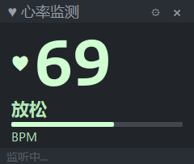

# Mi Band HR

小米手环心率桌面悬浮窗，通过蓝牙 BLE 接收手环广播的标准 Heart Rate Service 数据，以 PyQt5 悬浮窗实时显示心率，**本项目完全使用deepseek + cluade code开发，可能存在未知错误导致无法运行**



## 

## 功能

- **BLE 实时心率** — 连接小米手环（或任意支持标准 Heart Rate Service 的 BLE 设备），实时显示心率 BPM
- **心率区间配色** — 根据当前心率自动切换文字/心形颜色，区间可在 `hr_zones.json` 中自定义
- **断线自动重连** — 手环断开后自动扫描并重连，无需手动干预
- **无边框悬浮窗** — 支持鼠标拖拽移动、边缘拖拽缩放
- **透明背景** — 可切换透明/半透明背景模式，透明模式下只显示心率和核心 UI
- **字体缩放** — 7 档字体大小预设 (70% ~ 150%)
- **内容对齐** — 左对齐 / 居中 / 右对齐
- **始终置顶** — 可切换窗口是否置顶
- **设备名匹配** — 支持按蓝牙设备名匹配目标手环


## 系统要求

- Windows 10 / 11（蓝牙 BLE 支持）
- Python 3.10+
- 蓝牙适配器（笔记本内置即可）


## 安装

```bash
# 克隆项目
git clone <repo-url>
cd mi-band-hr

# 创建虚拟环境
python -m venv .venv

# 激活虚拟环境
.venv\Scripts\activate

# 安装依赖
pip install -r requirements.txt
```


## 启动

```bash
# 方式一：命令行
python mi_band_hr.py

# 方式二：双击运行
run.bat
```

首次运行后会在项目目录生成 `hr_zones.json`，可编辑该文件配置心率区间和目标设备名。

## 

## 配置

编辑 `hr_zones.json`：

```json
{
    "device_name": "Mi Band",
    "zones": [
        { "name": "放松", "max": 90,  "color": "#CBFFCD", "accent": "#AAE7AC" },
        { "name": "热身", "max": 115, "color": "#4C98AF", "accent": "#81B9C7" },
        { "name": "燃脂", "max": 134, "color": "#00FF22", "accent": "#4DFF65" },
        { "name": "有氧", "max": 157, "color": "#E5F321", "accent": "#F4F664" },
        { "name": "无氧", "max": 172, "color": "#B06527", "accent": "#D8BA93" },
        { "name": "极限", "max": 999, "color": "#F43636", "accent": "#EF9A9A" }
    ],
    "display": {
        "show_heart": true,
        "show_zone_label": true,
        "show_zone_bar": true,
        "topmost": true,
        "alignment": 132,
        "font_scale": 1.0
    }
}
```

- `device_name` — 蓝牙设备名关键词（忽略大小写），留空则自动匹配含 "Band" 的设备
- `zones` — 心率区间列表，`max` 为区间上限，`color` 为主色调，`accent` 为辅助色
- `display` — 显示偏好，可通过悬浮窗右键菜单或齿轮按钮调整

## 

## 操作

| 操作   | 方式                 |
| ---- | ------------------ |
| 移动窗口 | 拖拽窗口内部             |
| 缩放窗口 | 拖拽窗口边缘或角落          |
| 设置菜单 | 点击齿轮按钮 或 右键窗口      |
| 退出   | 点击 × 按钮 或 菜单选择"退出" |

## 

## 技术栈

- [PyQt5](https://pypi.org/project/PyQt5/) — 悬浮窗 UI（`WA_TranslucentBackground` 实现逐像素透明）
- [Bleak](https://pypi.org/project/bleak/) — 跨平台 BLE 客户端
- asyncio + threading — BLE 后台事件循环与 Qt 主线程分离

## 

## 项目结构

```
mi-band-hr/
├── mi_band_hr.py    # 入口，日志初始化，启动 Qt 和 BLE 线程
├── ble_core.py      # BLE 扫描、连接、心率解析、断线重连
├── overlay_qt.py    # PyQt5 悬浮窗 UI，拖拽/缩放/菜单/样式
├── config.py        # JSON 配置读写，心率区间匹配
├── hr_zones.json    # 用户配置文件
├── requirements.txt # Python 依赖
└── run.bat          # Windows 一键启动脚本
```
